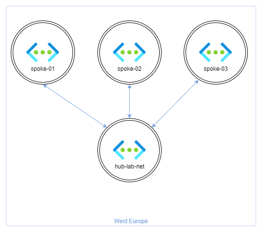
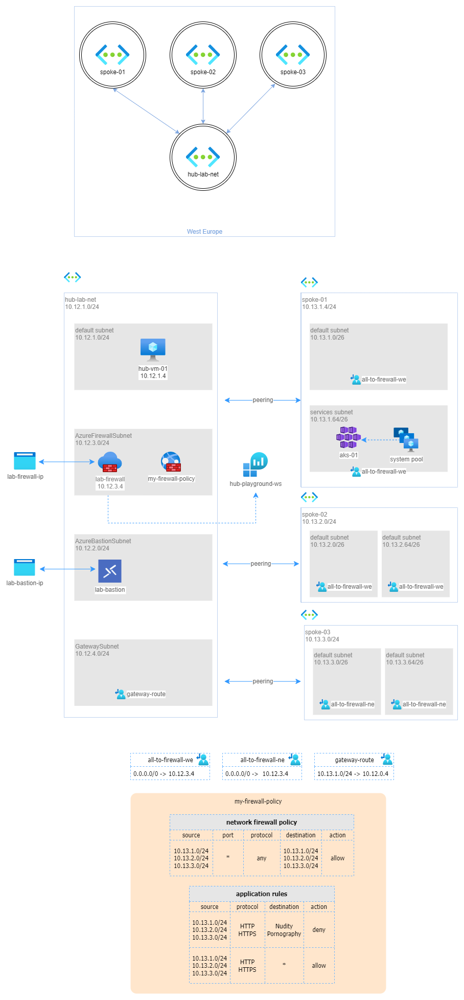

<h1 align="center">the AKS (Azure Kubernetes Service) 🤯  playground </h1>

  Built with ❤︎ by
  <a href="https://github.com/nicolgit">nicolgit</a>,  <a href="https://github.com/lucapisano">lucapisano</a> and  <a href="https://github.com/mela125">mela125</a>
  </a>

  

This repo contains a preconfigured Azure Kubernetes Service cluster embedded inside an hub-and-spoke network topology, aligned to the Azure enterprise-scale landing zone reference architecture, useful for testing and studying network configurations in a controlled, repeatable environment.

As bonus many scenarios with step-by-step solutions for studying and learning are also available.

The "playground" is composed by:
  * a hub and spoke network topologies aligned with the <a href="https://docs.microsoft.com/en-us/azure/cloud-adoption-framework/ready/enterprise-scale/architecture" target="_blank">Microsoft Enterprise scale landing zone</a> reference architecture
  * an AKS cluster deployed in one spoke
  * routing table(s) and firewall policy configured so that all the AKS outbound traffic is routed through the firewall

# Deploy to Azure

You can use the following button to deploy the demo to your Azure subscription:

| | &nbsp; | &nbsp; |
|---|---|---|
|1| the **AKS** playground deploys `hub-lab-net` spokes `01`-`02`-`03` an `AKS Cluster` and all the required routing | 

# Architecture

This diagram shows a detailed version with also all subnets, virtual machines, NVAs, IPs and Firewalls.

the ARM template [hub-spoke-aks.json](modules-arm/hub-spoke-aks.json) deploys:

* 4 Azure Virtual Networks:
    * `hub-lab-net` with 4 subnets:
        * an empty `default` subnet 
        * AzureFirewallSubet: a subnet is used by Azure Firewall
        * AzureBastionSubnet: a subnet is used by Azure Bastion
        * GatewaySubnet: a subnet ready to deploy an by Azure Virtual Network Gateway
    * `spoke-01` with 2 subnets `default` and `services`
    * `spoke-02` with 2 subnets `default` and `services`
    * `spoke-03` with 2 subnets `default` and `services`
* `lab-firewall`: an Azure Firewall **premium** on the `hub-lab-net`  network
* `my-firewall-policy`: a sample policy that implements the any-to-any routing between spokes and all the internet traffic outbound
* `all-to-firewall-we` and `all-to-firewall-ne`: route tables that forward all the outbound traffic through the central Azure Firewall
* `hub-playground-ws`: a log analytics workspace where to collect all firewall logs
* `aks-01`: an Azure Kubernetes Service cluster deployed on `services` `spoke-01` subnet

`aks-01` cluster has 1 node pool and 2 sample workload deployed: `azure vote front` and `azure vote back` taken from the [Microsoft Artifact Registry](https://mcr.microsoft.com/): a super-simple front-end/back-end application that exposes a sample UI over HTTP. 
To test the workload, you need to know the IP of the front-end pod. 

You can find this IP in:
* Azure Portal > `aks-01` > Workloads > `azure-vote-front` > pods > `azure-vote-front-##########-#####` > pod IP (something like `10.13.1.74`) 

To test it: access to `hub-vm-01` in RDP/bastion and open in Edge `http://x.x.x.x` (where `x.x.x.x` is the IP found above)

## Playground's scenarios
Here there is a list of tested scenarios usable on this playground.

For each scenario you have:

* **prerequisites**: component to deploy required to implement the solution (only the hub, also one on-prem playground or both)
* **solution**: a step-by-step sequence to implement the solution
* **test solution**: a procedure to follow, to verify if the scenario is working as expected

| | scenario description | solution |
|---|---|---|
| 1 | Deploy a confidential computing nodes pool | [see the documentation](scenarios/confidential-01.md) |
| 2 | Expose a kubernetes service with Azure Front Door | [see the documentation](scenarios/front-door.md) |

